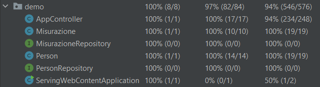

# RELAZIONE PROGETTO POMPA INSULINICA
FONDAMENTI DI INGEGNERIA DEL SOFTWARE 2022/2023

Canelli Alessia \
Massagrande Marco \
Tonelli Alessio

## INTRODUZIONE
L'obbiettivo dell'elaborato è quello di creare
un sistema che simula l'utilizzo di una pompa insulinica
sotto forma di applicazione Web.
Bisogna considerare che la pompa insulinica di
base è un sistema embedded, per cui sono stati fatti dei
trade-off sulle funzionalità che la pompa dovesse avere
ed è stato scelto di ricreare la misurazione della
glicemia e la eventuale memorizzazione su di una cronologia.

## REQUISITI
Si vuole progettare un sistema informatico per gestire
la cronologia delle misurazioni di glicemia e insulina
che vengono effettuate da una pompa insulinica.
Per ogni utente si registra: un nome, un cognome,
un'email, un username e una password.
Il sistema memorizza: 
- le misurazioni della pompa insulinica;
- l'id dell'utente che effettua la misurazione;
- il valore di glicemia;
- il valore d'insulina iniettata;
- un commento che l'utente può inserire;
- l'orario e la data dell'avvenuta misurazione.

## SCENARI

### 1 L'UTENTE CREA UN NUOVO ACCOUNT 
- Un nuovo utente che soffre di diabete vuole accedere alla pagina per tenere monitorato le sue iniezioni d'insulina,
essendo che è il primo suo accesso dovrà crearsi un nuovo account.
- L'utente per crearsi il suo account personale dovrà schiacciare sul bottone "crea nuovo account", una volta fatto ciò
verrà indirizzato su una pagina in cui gli verrà richiesto d'inserire il suo nome, cognome, email, username e password.
Ognuna di queste credenziali avrà delle specifiche condizioni che devono essere rispettate per far si che l'account venga creato
correttamente.
- Se, durante la creazione dell'account, non vengono soddisfatti i requisiti necessari delle varie credenziali
non sarà possibile creare l'account e verranno visualizzati dei messaggi di errore.
- Una volta che la creazione dell'account è avvenuta correttamente, l'utente verrà indirizzato alla pagina di login.

### 2 L'UTENTE EFFETTUA IL LOGIN AL SUO ACCOUNT
- L'utente dopo aver creato l'account si aspetta che utilizzando le credenziali scelte in precedenza riesca ad accedere al suo account personale.
- Una volta che l'account è stato creato verrà visualizzata la pagina login. In questa pagina è presente un form, in cui
vengono richiesti username e password. Sono inoltre presenti due pulsanti, uno per creare un nuovo account e uno per accedere
alla pagina utente. A questo punto una volta che l'utente ha inserito le proprie credenziali in modo corretto e negli appositi 
spazi schiacciando sul pulsante "Accedi" riuscirà ad accedere alla home.
- Nel caso in cui l'utente si sia dimenticato le sue credenziali, o semplicemente le inserisce in modo sbagliato, verrà visualizzato 
un messaggio di errore a seconda che sia stato sbagliato il nome utente o la password. L'utente a questo punto rimarrà sulla
pagina login e potrà reinserire nuovamente le proprie credenziali (non c'è un limite massimo di errori che l'utente può fare). 
- Una volta inserite le credenziali corrette l'utente verrà indirizzato alla pagina home all'interno del proprio account. 
A questo punto potrà eseguire tutte le azioni necessarie per monitorare al meglio la sua condizione salutare.

### 3 L'UTENTE VISUALIZZA LE SUE CREDENZIALI E LE PU0' MODIFICARE 
- L'utente vuole visualizzare le sue credenziali create la prima volta in cui ha avuto accesso alla pagina, in questa
pagina sarà possibile anche modificare i propri dati.
- L'utente vuole modificare le proprie credenziali, per fare questo, una volta all'interno della sua pagina home, dovrà 
schiacciare il bottone "Profilo" e verrà indirizzato in una pagina contente tutte le credenziali in modalità solo lettura.
Schiacciando sul tasto "Modifica", l'utente avrà la possibilità di modificare tutti i campi presenti nella pagina, sempre
rispettando gli stessi requisiti della creazione di un nuovo utente. Per salvare le modifiche l'utente dovrà schiacciare
sul bottone "Salva".
- Se i dati che vengono modificati non rispettano i vincoli stabiliti non sarà possibile effettuare la modifica e verranno
visualizzati dei messaggi di errore.
- Dopo aver premuto il pulsante "Salva" l'utente verrà indirizzato sulla pagina del suo profilo in cui si potranno vedere
le modifiche appena fatte.

### 4 L'UTENTE SI DEVE FARE UN INIEZIONE DI INSULINA
- Nel momento in cui l'utente ha il bisogno di fare un iniezione d'insulina si aspetta di poter inserire nel sistema: 
  - la sua attuale glicemia 
  - l'insulina fatta 
  - un eventuale commento
e che successivamente questi dati vengano salvati in modo da poter essere consultati in seguito
assieme a un medico in caso di necessità.
- Quando dalla pagina utente si seleziona il tasto “Pompa insulinica” si apre una pagina in cui l'utente può inserire
il suo valore attuale della glicemia e l'insulina da fare. Inoltre sarà possibile inserire un commento prima di premere il tasto "Salva",
il quale salverà i dati appena inseriti nella cronologia.
- Nel momento in cui l'utente va a inserire la sua glicemia attuale e la quantità d'insulina, queste devono rientrare in un determinato range di valori.
Nel caso in cui non fosse così verranno visualizzati degli errori e l'iniezione non verrà salvata in cronologia.
- Una volta che i valori sono stati scritti correttamente, saranno presenti all'interno della cronologia.

### 5 L'UTENTE DOPO AVER INSERITO IN CRONOLOGIA UN'INIEZIONE SBAGLIATA VUOLE CANCELLARLA
- Nel caso in cui l'utente in precedenza abbia sbagliato a inserire un'iniezione, ha la necessita di poter eliminare quest'ultima in modo
da non salvare informazioni sbagliate.
- Quando dalla pagina Home si seleziona il tasto “Cronologia” appare la lista di tutte le iniezioni che sono state
fatte con relativo giorno, orario, glicemia, commento e quantità d'insulina che è stata fatta. Selezionando il tasto "Cancella",
vicino alla riga desiderata, l'utente ha la possibilità di cancellarla.
- Nel caso in cui l'utente erroneamente cancelli una riga, per ripristinarla dovrà reinserirla manualmente accedendo alla sezione "Pompa Insulinica"
- Una volta premuto il tasto, l'utente visualizzerà tutta la cronologia meno la riga da lui appena cancellata.

### 6 L'UTENTE ELIMINA TUTTA LA CRONOLOGIA
- Dopo aver fatto un controllo dal medico l'utente vuole cancellare tutta la cronologia per liberare spazio.
- L'utente ha la possibilità di eliminare l'intera cronologia, per fare questo dovrà premere il tasto "cancella tutto",
dopo di ciò verranno cancellate tutte le righe contenti i dati d'insulina, glicemia e commenti vari.
- Nel caso in cui l'utente dovesse eliminare erroneamente tutta la cronologia non sarà possibile ripristinarla, l'operazione è irreversibile.
- L'utente dopo aver premuto il pulsante visualizzerà la cronologia vuota

### 7 L'UTENTE DOPO AVER EFFETTUATO LE OPERAZINI NECESSARIE DESIDERA USCIRE DAL PROPRIO PROFILO
- L'utente dopo aver fatto le operazioni di cui aveva bisogno, desidera effettuare il logout dal proprio profilo
  in modo che nessun altro possa vedere le sue informazioni personali.
- Quando l'utente si trova nella pagina Home ha la possibilità di selezionare il pulsante "Logout" e di uscire quindi dal
  proprio account, venendo indirizzato alla pagina di login.
- Nel caso in cui l'utente effettua per sbaglio il logout potrà effettuare nuovamente l'accesso con le sue credenziali 
attraverso la pagina di login.
- Una volta che è stato effettuato il logout l'utente si trova nuovamente alla pagina di login in cui potrà accedere 
nuovamente al proprio account nel caso lo volesse.

### 8 L'UTENTE VUOLE RITORNARE ALLA PAGINA PRECEDENTE
- L'utente quando si trova un tasto "Indietro", può tornare alla schermata precedente.
- Nelle schermate "Profilo", "Pompa Insulinica", "Cronologia" è presente un tasto "Indietro" che se viene premuto
reindirizza l'utente alla schermata principale del suo account.
Nella schermata di modifica del profilo, l'utente può non salvare le modifiche e tornare indietro alla pagina profilo,
in questo caso si può verificare il fatto che ogni tipo di modifica che si stava facendo non viene salvata.
- Nel caso in cui l'utente selezioni per sbaglio il tasto "Indietro" potrà tornare alla pagina in cui si trovava 
ripercorrendo gli stessi passi fatti in precedenza.
- Dopo aver schiacciato il tasto "Indietro", l'utente ritornerà alla pagina precedente.

### 9 L'UTENTE ELIMINA IL PROPRIO ACCOUNT
- Nel caso in cui il paziente decida di non utilizzare più questo sito per monitorare il suo diabete, vuole avere
  la possibilità di eliminare il proprio account con i relativi dati in esso contenuti.
- Quando l'utente si trova nella schermata Home potrà selezionare il tasto "Elimina account" tramite il quale potrà
  eliminare l'account e tutti i dati presenti in esso definitivamente.
- Nel caso in cui l'utente eliminasse l'account e poi volesse ripristinarlo non sarebbe possibile. 
Per poter riavere l'account l'utente dovrà crearne uno nuovo.
- Dopo aver eliminato l'account l'utente viene indirizzato alla pagina di login. A questo punto l'account non esiste più e
non è più possibile accedervi.

## ASSUNZIONI
Per poter svolgere l’elaborato abbiamo dovuto effettuare
delle scelte progettuali necessarie per chiarire i
diversi flussi di esecuzione.

Le nostre assunzioni sono state:
* Si suppone che non esistano utenti con lo stesso username,
  di fatto l'username funge da identificativo univoco dell'utente.
* Un utente non può accedere al sistema senza avere un
  account.
* È possibile visualizzare la cronologia delle misurazioni
  solo se si ha effettuato almeno una misurazione.

## DOCUMENTAZIONE
Di seguito vengono presentati tutti i documenti creati
in fase di progettazione e sviluppo.

### USE CASE

#### USE CASE UTENTE
~~inserire~~

### METODOLOGIA DI SVILUPPO
Abbiamo utilizzato una metodologia di sviluppo Agile
di tipo incrementale per poter avere una consegna
del progetto e uno sviluppo rapido del software
andando a interfogliare le fasi di progettazione,
specifica e implementazione.
Abbiamo fatto brevi iterazioni e prodotto diverse versioni
del progetto in modo tale da avere una continua visione
del prodotto finale. Essendo di tipo incrementale
lo sviluppo ci ha consentito di apportare modifiche al codice
senza particolari difficoltà, inoltre seguendo questo tipo
di approccio la documentazione risulta essere minima
e non presenta ogni versione del codice che è stata realizzata.
Ci siamo comunque quotidianamente confrontati sulle
attività svolte e sulle attività in elaborazione oltre
che su vari problemi di sviluppo.
Abbiamo usato Git come sistema di versioning e GitHb come piattaforma
per la condivisione del codice, di fatto il nostro gruppo ha
sempre lavorato contemporaneamente al codice
garantendo una comprensione totale da parte dei partecipanti
di ogni modifica che è stata fatta sul codice.

### PATTERN ARCHITETTURALE
Per l’architettura del software abbiamo utilizzato
il pattern MVC (Model View Control) suddividendo così la
parte grafica da quella di gestione delle informazioni
e da quella di controllo.
La motivazione principale per cui è stato utilizzato
questo pattern è la possibilità di realizzare sequenzialmente
le componenti, questa indipendenza tra le componenti
ha garantito la flessibilità nella realizzazione
dell’interfaccia d’’accesso del sistema
dell’utente. In una fase iniziale infatti la grafica
dei dati era molto scarna, sufficiente
per verificare che la componente di gestione dei dati
fosse funzionante, poi in una
fase finale il layout della componente View è stato
raffinato e reso semplice e chiaro.

I package solitamente sono:
*Modello: sottoparte del sistema che si occupa di
gestire i dati del sistema e le
operazioni associate ai dati
*Vista: sottoparte del sistema che definisce e
gestisce come i dati sono
rappresentati all’utente
*Controllore: sottoparte del sistema che si
occupa di gestire le interazioni tra
l’utente e i dati del sistema, notificando tali
interazioni alle componenti Modello e Vista

### VERIFICA E VALIDAZIONE
~~inserire~~

#### CHECKING
Il codice è stato costantemente rivisto, si è cercato
d'identificare le componenti di codice incorretto o che
può essere migliorato. Inoltre sono stati fatti molteplici
controlli sull'indentazione e sulla nomenclatura del codice
andando eventualmente a eseguire refactoring.

#### PROGRAM TESTING

##### Test crea utente
1. Viene creato un nuovo utente in cui viene lasciato in bianco il campo relativo al nome. 
Verifico che l'account non sia stato creato e venga chiesti d'inserire nuovamente le credenziali.
2. Viene creato un nuovo utente in cui viene lasciato in bianco il campo relativo al cognome.
Verifico che l'account non sia stato creato e venga chiesti d'inserire nuovamente le credenziali.
3. Viene creato un nuovo utente in cui viene inserita una mail non valida.
   Verifico che l'account non sia stato creato e venga chiesti d'inserire nuovamente le credenziali. 
4. Viene creato un nuovo utente in cui viene inserito un username errato.
   Verifico che l'account non sia stato creato e venga chiesti d'inserire nuovamente le credenziali. 
5. Viene creato un nuovo utente in cui viene inserita una password che non rispetta i requisiti richiesti.
   Verifico che l'account non sia stato creato e venga chiesti d'inserire nuovamente le credenziali. 
6. Viene creato un utente con le credenziali corrette (i valori rispettano i requisiti stabiliti). Verifico che l'account sia stato effettivamente creato. 
7. Viene creato un nuovo utente e viene scelto un username già esistente.
   Verifico che l'account non sia stato creato e venga chiesti d'inserire nuovamente le credenziali.
8. Viene creato un nuovo utente diverso da quello creato nel test 6. Verifico che l'account venga effettivamente creato.

CIAO

##### Test Login
1. Eseguo il login inserendo un username errato. Verifico di non aver fatto il login.
2. Eseguo il login inserendo una password errato. Verifico di non aver fatto il login.
3. Eseguo il login inserendo sia l'username che la password errati. Verifico di non aver fatto il login. 
4. Eseguo il login con le credenziali corrette. Verifico che il login è avvenuto con successo e sono nella pagina home.

##### Test pagina Home
1. Premo il tasto Profilo e verifico di essere entrato effettivamente nella pagina desiderata.
2. Premo il tasto Pompa Insulinica e verifico di essere entrato effettivamente nella pagina desiderata.
3. Premo il tasto Cronologia e verifico di rimanere nella pagina Home, in quanto non avendo ancora fatto nessuna iniezione la cronologia sarà vuota.

##### Test Profilo
1. Modifico il nome in modo errato e verifico che la modifica non sia avvenuta.
2. Modifico il cognome in modo errato e verifico che la modifica non sia avvenuta.
3. Modifico il l'email in modo errato e verifico che la modifica non sia avvenuta.
4. Modifico l'username in modo errato e verifico che la modifica non sia avvenuta.
5. Modifico l'username utilizzando un username già esistente. Verifico quindi che la modifica non sia avvenuta.
6. Modifico la password in modo errato e verifico che la modifica non sia avvenuta.
7. Modifico la mail in modo corretto. Verifico che la modifica sia avvenuta con successo.
8. Modifico l'username in modo corretto. Verifico che la modifica sia avvenuta con successo.
9. Premo il tasto indietro presente nella pagina Profilo e verifico di essere tornato alla pagina Home.

##### Test Pompa Insulinica
1. Inserisco una nuova iniezione. Nel campo glicemia si inserisce un valore sbagliato (non compreso tra 100 e 300). 
Verifico che l'iniezione non sia andata a buon fine.
2. Inserisco una nuova iniezione. Nel campo glicemia si inserisce un valore in lettere.
   Verifico che l'iniezione non sia andata a buon fine.
3. Inserisco misurazione e verifico che sia stata salvata.
4. Inserisco una misurazione che non rispetta i requisiti e verifico che la modifica non sia avvenuta.

##### Test Cronologia
1. Se elimino una riga questa viene eliminata.
2. Se elimino tutta la cronologia verifico che venga effettivamente eliminata e torno nella home.

#### Test Logout
1. Premendo logout l'utente viene reindirizzato alla pagina di login

#### Test indietro
1. Premendo il tasto indietro l'utente deve andare alla pagina precedente

### Coverage
La coverage ottenuta dai seguenti test è la seguente:

#### TESTING DI ACCETTAZIONE
Il progetto è stato testato da individui che non
appartengono al mondo dell’informatica, in
modo da avere l’impressione della persona più vicina
all’effettivo utilizzatore di
questo prodotto una volta distribuito.
L’utente è stato libera di utilizzare il software, in
modo da verificare che il sistema sia chiaro e intuitivo,
grazie a questo passaggio
siamo stati in grado di migliorare alcuni aspetti relativi
alla fruizione dei dati e anche
ad aggiungere delle funzionalità che anche se sottili sono
sufficienti a rendere
l’utente a proprio agio con il prodotto.
